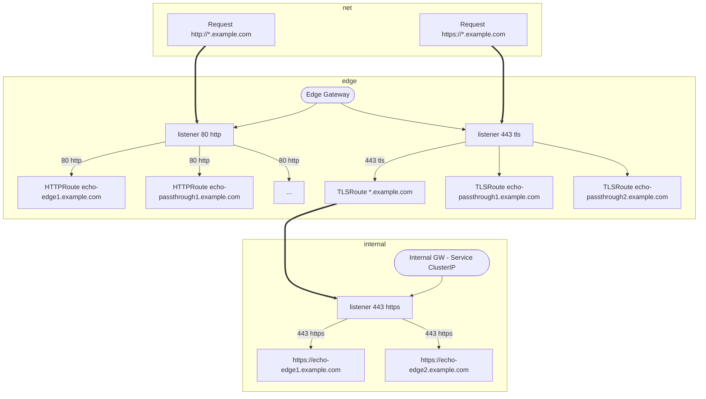

# Gatewayapi Showcase - Using Contour?

Implements [Contour](https://projectcontour.io) ingress controller featuring [Gateway API](https://gateway-api.sigs.k8s.io/) 

EXPERIMENTAL

Try to implement this usecase:

1. I have a set of services, Urls following a naming convention: <service>.<basUrl>
2. all services have a common ip/dns name
3. some use edge termination, some TLS passthrough
4. both https and http shall be available
5. The gateway internal design shall leak as little as possible into the applications' implementations.
6. Gateway API shall be used

AddOn: maybe use other controllers than contour!

Scope:
- [ ] deploy [Contour](https://projectcontour.io) controller (by a helm chart?)
- [ ] deploy [Gateway API](https://gateway-api.sigs.k8s.io/)
- [ ] share common endpoint for [HTTPRoute](https://gateway-api.sigs.k8s.io/api-types/httproute/) and [TLSRoute](https://gateway-api.sigs.k8s.io/reference/spec/#gateway.networking.k8s.io/v1alpha2.TLSRoute)
- [ ] enable HTTPProxy and Ingress for legacy
- [ ] have proper tests

Deploy [dynamically provisioned](https://projectcontour.io/docs/1.29/guides/gateway-api/#option-2-dynamically-provisioned)

# Design

Assume those services.

- echo-edge-1.example.com - edge termination
- echo-edge-2.example.com - edge termination
- echo-passthrough1.example.com  - passhtrough termination
- echo-passthrough2.example.com  - passhtrough termination

Idea1, produces 1 extra network hop for https edge termination

> [!TIP]
> Create a helm chart for the use case + one for the GW implementations

# Missing
- GRPCRoute
- Observability
# Links
- https://projectcontour.io/docs/1.29/config/gateway-api/
- https://github.com/projectcontour/contour - upstream 
- https://projectcontour.io/docs/1.29/config/api/ - contour api reference
